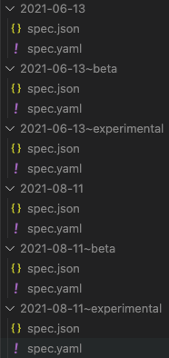

# API Versioning

Fundamental to building an incredible API is the ability to evolve resources over time while giving our customers and partners time to adjust to any changes. This section focuses on how we enable product teams at Snyk to confidently develop endpoints that can evolve over time with versioning.

## Lifecycle of a resource version

At its core, versioning is about defining a lifecycle for versions of resources. This lifecycle impacts how we implement resources, how those resources are consumed, and forms the guarantees we provide our customers.

Evolving resources, releasing them with the appropriate stability level and ensuring they meet the appropriate criteria is the responsibility of the owning team.

### Breaking changes

A new version of a resource is required if a **[breaking change](https://github.com/watson-developer-cloud/api-guidelines#what-counts-as-breaking)** is made. We strongly prefer only making additive changes if possible. However, if a breaking change must be made a new version of the endpoint **must** be introduced.

We never make a change to an existing version of an endpoint that could result in our customer’s or partner’s production code-breaking. Instead, we evolve our endpoints by introducing new versions and provide our customers ample time & warning to upgrade.

A change in stability also requires a new resource version date. Retroactive releases suddenly showing up at a higher stability can introduce unexpected breaking changes in the API.

## Versioning resources

### Resource specification versions

The specification for how a resource behaves and what it contains is expressed with [OpenAPI 3](https://spec.openapis.org/oas/latest.html). This OpenAPI specification is the single source of truth for what goes into a resource version.

### Version format

A version consists of:

- A **date** (_YYYY-mm-dd_)
- A **stability level**, one of: `beta`, or `ga`

The version date must be the day that the resource version is made available.

Versions must not be released or requested at a future date.

Version dates must always be interpreted assuming a UTC timezone.

### Stability levels

Stability levels guarantee a certain level of consistency in the API contract, as well as its availability and potential expiration. They also define the **lifecycle stage** of a resource version up until deprecation.

These are:

- `beta`
  - The resource version is being evaluated as a candidate for general availability by partners and customers.
  - It will be available for at least **90 days** after a subsequent resource version _of equal or greater stability_ (`beta` or `ga`) is published, after which it may be removed.
  - During its availability, it must not be revised with incompatible and breaking changes.
  - It may be revised with backwards-compatible, additive changes.
- `ga`
  - The resource version is a generally available feature of the API.
  - It will be available for at least **180 days** after a subsequent `ga` resource version is published, after which it may be removed.
  - During its availability, it must not be revised with incompatible and breaking changes.
  - It may be revised with backwards-compatible, additive changes.

Historically there have been `experimental` and `wip` endpoints, however these
are no longer supported due to the large amount of endpoints not being promoted
out of those stabilities. Existing endpoints may carry these stabilities but
any new endpoints must be created as either `beta` or `ga`. We encourage teams
to promote any old endpoints out of these stabilities.

### Promoting stability of a resource over time

To promote a more stable version of a resource, release a new version with the desired stability commitment, on the date it is made available.

Other versions of the resource must continue to remain available through [deprecation and sunset](#deprecation-sunset).

These resource versions may share some common implementation. However, requests and responses at each version must conform to each respective OpenAPI specification.

#### Don't rewrite version history

Resource versions MUST NOT be modified in-place retroactively with a stability increase. Instead, release a new version with the higher stability, dated according to its availability.

A version's stability cannot be modified in-place because this effectively rewrites API history. If a past API version suddenly becomes more stable, this can change the resolved version consumers interact with, with unexpected results.

An example of how this can cause problems:

- A version is released at `2021-06-04~beta`
- It gets modified in-place to increase stability, eventually becoming `2021-06-04~ga`.
- Another version starts at `2021-08-12~beta`.
- A client evaluates the API at version `2021-10-01~ga`. This resolves to
  `2021-06-04~ga`. It works well so the client pins on this version (`2021-10-01`).
- `2021-08-12~beta` gets modified in-place to `2021-08-12~ga` on `2021-10-15`.
- The above client requests for `2021-10-01~ga` now suddenly resolve to a surprise GA version that wasn't there before: `2021-08-12~ga`. Unfortunately, it's a breaking change...

If the `2021-08-12~beta` promotion to GA was dated when it actually took place (`2021-10-15`), the client would not have been broken by the newer change.

### <a id="deprecation-sunset"></a>Deprecation and Sunset

When a new version of a resource is released, it deprecates any prior versions of the resource at equal or lower stability. A version is considered to be in this **deprecated** state until it is past the mandatory duration of availability for its stability level (as defined above), after which, it may be **sunset** — removed and no longer available.

## Resource versioning in projects

Our lifecycle version management tooling, [Vervet](https://github.com/snyk/vervet), assumes a directory structure of resources and their version release dates, each containing an OpenAPI `spec.yaml` defining the resource at that version.


These specs can and generally should be co-located with their code implementation. That implementation may even be generated in-part from the spec.

#### Version stability levels

A version's stability level is expressed in each OpenAPI `spec.yaml` with a top-level extension, `x-snyk-api-stability`.


### API versions from individual resources

[**Vervet**, an API lifecycle management tool](https://github.com/snyk/vervet), merges all the individual resources and their versions in the directory structure described above, into a collection of OpenAPI specifications for the entire API at each version.



These versions may then be published, used to generate documentation, client SDKs, etc.

Versions for the entire API are expressed in the form _`{version date}~{stability level}`_, assuming GA was not specified.

## Introducing Simplified Versioning (as of 2024-10-15)

As of **2024-10-15**,  "simplified versioning" model was introduced to further streamline API version management. This change introduces a "synthetic" version, which impacts both the developer and consumer sides of the API in a few important ways:

- **Stability at Path Level**: This is the first version where stability has been dropped from the specification level to the individual path level. This means that each API path can now be either `beta` or `ga`, simplifying how stability is managed.
- **No More Experimental Stability**: The `experimental` stability level has been completely removed, so paths can only be marked as `beta` or `ga`.
- **No Change to Developer Process**: Developers will continue to define their APIs in the same way, using OpenAPI `spec.yaml` files. The way versions are collated and the final versioned specs are built has changed internally, but this does not impact the development process.
- **Simplified Consumer Access**: For end users of the API, the main difference is that they no longer need to specify stability when making a request. Consumers can simply call with a date, and the system will resolve whether the requested path is `ga` or `beta`. For example:
  - `GET /path/to/resource?version=2024-10-16` will automatically match the latest version available as of the specified date, resolving the stability level internally.
- **One-way Promotion**: Once a path is promoted to `ga`, a subsequent `beta` version can no longer be published for that path. This ensures a consistent forward progression in stability without regressions.

### <a id="resolving-versions"></a>How are versions accessed and resolved by consumers?

Consumers of the API can request a version of the API at any point in time. With simplified versioning, the stability level no longer needs to be explicitly specified. These dates and versions do not need to exactly match the resolved versions — they are resolved by a search. For example a request like:

```json
GET /path/to/resource?version=2024-10-16
```

will match the most recent OpenAPI specification containing the resource as of the specified date. If the specified path is available as `beta` or `ga`, it will be automatically resolved by the system.

## Versioning in requests and responses

With the concept of versioning established, requests and responses must support certain parameters and headers related to versioning.

### `version` query parameter

All requests must provide a `?version=YYYY-mm-dd` parameter (for requests to versions before 2024-10-15 `~stability` must also be included):

- `YYYY-mm-dd` is always required and must not be set to after today's date.
- Stability no longer needs to be specified as of 2024-10-15. The system will resolve if the requested path is `beta` or `ga` automatically.

Services are responsible for routing requests at the given `version` to the appropriate matching resource version implementation — or responding with `HTTP 404` if no version of the resource exists.

If a request does not provide a version query parameter or the format of the parameter is misformed a 400 Bad Request _must_ be returned. This is to prevent our customer's implementations from breaking as we release new versions of a resource.

### <a id="response-headers"></a>Versioning response headers

Responses must inform the requesting client how the version was resolved and the status of the matched version with these headers:

- `deprecation` - Indicates a newer version of the resource that deprecates the one that was matched. Conforms to [draft-dalal-deprecation-header-00](https://tools.ietf.org/id/draft-dalal-deprecation-header-00.html).
- `snyk-version-lifecycle-stage` - Indicates the actual lifecycle stage of the resource version that matched. A matched resource may be of equal or greater stability than requested. This stage also indicates `deprecated` and `sunset` lifecycle stages as described above.
- `snyk-version-requested` - Confirm the version that was requested.
- `snyk-version-served` - The version that matched the request. Note that the matched version may be of equal or greater stability, and at the most recent version date prior to the date requested.
- `sunset` - [RFC 8594](https://datatracker.ietf.org/doc/html/rfc8594) standard header reflecting the sunset date of a deprecated resource.

### Consuming the versioned API

Using the `?version=` parameter, clients may choose to interact with any released version of the API.

To release a stable application, choose an announced GA release date, and be assured that the API will not change for at least 180 days past the following GA release.

To evaluate a recent beta feature, you might pin your version date at "yesterday" and use that with `~beta`. Keep that version date pinned at the date you started with, until you're ready to evaluate or support a newer release of the API.

Clients must be developed against (or generated from) a pinned version of the API declaring a fixed _YYYY-mm-dd_ release date. Otherwise the client may fail in unexpected ways, possibly with undefined behavior when new versions of the API are released.

The response headers can be used to receive advance notice that an API change is coming. The [standard `sunset` header](https://datatracker.ietf.org/doc/html/rfc8594), for example, can be used to alert that the API needs to be updated soon.
