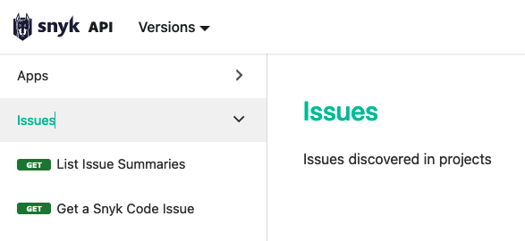
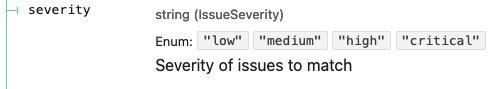
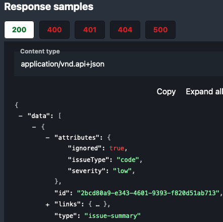

# Snyk API Standards

In order to provide a consistent [API as a platform](intro.md), Snyk APIs have additional requirements, building on [JSON API](jsonapi.md) and [Versioning](version.md) standards.

## Organization and group tenants for resources

Resources in the Snyk v3 API are located under an Organization and possibly a Group tenant, specified as a path prefix.

Resources addressed by Organization begin with `/v3/orgs/{org_id}/...`.

Resources addressed by Group begin with `/v3/groups/{group_id}/...`.

## Standard property conventions

Additional resource properties that must be used in resource attributes, where applicable.

### Resource lifecycle timestamps

These properties are optional on a resource, but should be used when applicable. These properties must be formatted as [ISO-8601 date-time strings](https://json-schema.org/understanding-json-schema/reference/string.html#dates-and-times).

#### `created`

When the resource was created (POST).

#### `updated`

When the resource was last updated (PATCH).

#### `deleted`

When the resource was deleted (DELETE), if the DELETE operation marks the
resource for deletion, or removes part of its content without actually removing
the existence of the resource.

## Naming Conventions

Casing conventions referenced below are defined in [Spectral's casing function documentation](https://meta.stoplight.io/docs/spectral/ZG9jOjExNg-core-functions#casing).

### Mixed case and acronyms

When using camel or pascal case, acronyms are treated as any other concatenated word. For example, `OrgId`, not `OrgID`. This avoids ambiguity and information loss that would otherwise interfere with automated processing of the API schema. For example, a camel case name following these acronym rules can be translated into snake case to produce more conventional Python symbol names.

### Parameter names and path components

Parameter and path variables must use **snake case** names.

```json
/resource/{resource_id}?foo_param=foo&bar_param=bar
```

Because these variables are represented in URLs, uppercase letters may cause problems on some client platforms; RFCs recommend that URLs are treated as case-sensitive, but it is a "should", not a "must". Dashes might cause problems for some code generators, ruling out kebab case.

### Referenced Entities

Entities referenced in other documents (using `$ref`) must use **pascal case** names.

Entities will be commonly represented as types or classes when generating code. Pascal case names are conventionally used for such symbols in most targeted languages.

### Schema properties

Schema properties use **camel case** names.

### Operation IDs

When naming an operation, think carefully about how it will look and feel in generated code. Operations generally map to method or function names.

Operation IDs should be readable, intuitive and self-descriptive.

Operation IDs must use **camel case** names. Example:

```json
operationId: getFoo
```

#### How to name operations

##### Prefix the operation ID with the action being performed

- GET becomes `get` for a single resource (by unique ID)
- GET becomes `list` for multiple resources (pagination and filtering)
- POST becomes `create`
- PATCH becomes `update`
- DELETE becomes `delete`

##### Suffix the operation ID with the resource

Use the singular form if the operation operates on a single resource, plural if it operates on a collection operation.

Examples:
- `getFoo` (get one)
- `listFoos` (get many)
- `createThing` (create one)
- `updateOtherThing` (update one)
- `deleteThings` (bulk delete)

##### Optionally, suffix the resource with any tenancy

If there are multiple ways to address the resource by tenancy, differentiate these as a resource name suffix.

Example: `getFooByOrg`, `deleteProjectByGroup`, etc.

### Header field names

```json
headers:
    snyk-requested-version: 2021-08-21~beta
    snyk-resolved-version: 2021-08-12~beta
```

[Header field names are case insensitive](https://datatracker.ietf.org/doc/html/rfc7230#section-3.2). Snyk v3 API specs must use kebab case for consistency.

## <a id="response-headers"></a>Response Headers

Certain headers are required in all v3 API responses.

- `snyk-request-id` - Relays a provided request UUID, or generates a new one, which is used to correlate the request to logs and downstream requests to other services.
- [Versioning response headers](version.md#response-headers).

## API Documentation

The quality of documentation generated from an OpenAPI specification depends quite a bit on content provided in certain fields. [Redoc](https://redoc.ly/docs/redoc/quickstart/intro/)-generated documentation is used below to illustrate the purpose of these fields and why we require them.

### Tags

The operations (GET, POST, etc) declared for resource paths must be organized with [Tags](https://swagger.io/specification/#tag-object). Tags are used to categorize the endpoints that operate on resources.



Tags organize the operations such as "List Issue Summaries" or "Get a Snyk Code Issue" under a single Resource category "Issues".

### Operation Summary

The [operation](https://swagger.io/specification/#operation-object) `summary` field provides a more useful and informative string that documents what the request method actually does. In the example above, one operation summary shown is "List Issue Summaries". If this is not specified, the `operationId` (getIssuesSummary) would have been displayed instead.

### Formats

`format: uuid` and `format: date-time` are essential for indicating a field is not just a string, but actually a UUID or an RFC3339 date string. This format is relied upon by request and response validation middleware.

Enum types (`{type: string, enum: [...]}`) should be used wherever it is possible to enumerate a closed set of valid values a field might have. This includes the set of resource types in our API.



Enums make for great self-documenting APIs.

## Examples

Request parameters and data attributes in response data [schema objects](https://swagger.io/specification/#schema-object) need the `example` field set in order to provide useful documentation. These are 



With examples, it's clear what to expect. One could even run a mock API server with this content!


Without examples, as an end-user I don't have much context here to know what these fields' values are going to look like! Links are most likely URLs, not just strings!

## Making the OpenAPI specification available

Every service in the v3 API must publish endpoints that list available versions and fetch specific published versions of the OpenAPI spec for all resources provided by that service to v3. These paths may be prefixed if needed (some services may provide other APIs in addition to v3).

These endpoints need to be defined in the OpenAPI spec at all versions. They are not JSON API resources, and are not themselves versioned. Response type is `application/json`.

### /openapi

Lists the available published versions of the API. Response body is an array of version strings.

### /openapi/{version}

Provides the OpenAPI 3 spec at `{version}` in JSON format. The version is resolved by [the same rules used to match the requested version](version.md#resolving-versions).
