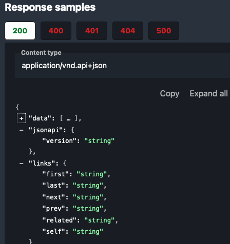

# Snyk REST API Standard

In order to provide a consistent [API as a platform](../principles/api_program.md), Snyk APIs have additional requirements, building on [JSON API](../principles/jsonapi.md) and [Versioning](../principles/version.md) standards.

# Resource IDs

[Resource IDs] must be defined with one of the following JSON Schema formats:

- `format: uuid`
- `format: uri`

UUIDs are most useful when the resource is already located by a unique UUID primary key.

URIs may be better when:

- The resource identity is best located by a URI. For example: [Package URLs (pURLs)](https://github.com/package-url/purl-spec).
- Other instances where a structured, semantically meaningful identifier provides a better experience. Vulnerabilities or issues might fall into this category.

# Organization and group tenants for resources

Resources in the Snyk REST API are located under an Organization and possibly a Group tenant, specified as a path prefix.

Resources addressed by Organization begin with `/rest/orgs/{org_id}/...`.

Resources addressed by Group begin with `/rest/groups/{group_id}/...`.

## Standard property conventions

Additional resource properties that must be used in resource attributes, where applicable.

### Timestamp properties

Attribute property names with an `_at` suffix must be timestamps. Timestamp properties must be formatted as [ISO-8601 date-time strings](https://json-schema.org/understanding-json-schema/reference/string.html#dates-and-times).

To declare this format on a timestamp attribute property, use:

`type: string, format: date-time`

### Resource lifecycle timestamps

These properties are optional on a resource, but should be used when applicable. These properties must be formatted as timestamps, due to the suffix.

#### `created_at`

When the resource was created (POST).

#### `updated_at`

When the resource was last updated (PATCH).

#### `deleted_at`

When the resource was deleted (DELETE), if the DELETE operation marks the
resource for deletion, or removes part of its content without actually removing
the existence of the resource.

## Naming Conventions

Casing conventions referenced below are defined in [Spectral's casing function documentation](https://meta.stoplight.io/docs/spectral/ZG9jOjExNg-core-functions#casing).

### Resource collections are plural

API paths locate resources and collections of resources. These are always nouns. Collections should use the plural form of the noun. For example:

- `/things` (collection of things)
- `/things/{thing_id}` (a specific thing, located in a collection of them)
- `/orgs/{org_id}/other_things` (a collection located in a specific org, located in a collection of orgs)

### Mixed case and acronyms

When using camel or pascal case, acronyms are treated as any other concatenated word. For example, `OrgId`, not `OrgID`. This avoids ambiguity and information loss that would otherwise interfere with automated processing of the API schema. For example, a camel case name following these acronym rules can be translated into snake case to produce more conventional Python symbol names.

### Parameter names and path components

Resource collection names, parameters and path variables must use **snake case** names.

```json
/some_resource/{resource_id}?foo_param=foo&bar_param=bar
```

Because these variables are represented in URLs, uppercase letters may cause problems on some client platforms; RFCs recommend that URLs are treated as case-sensitive, but it is a "should", not a "must". Dashes might cause problems for some code generators, ruling out kebab case.

### Referenced Entities

Entities referenced in other documents (using `$ref`) must use **pascal case** names.

Entities will be commonly represented as types or classes when generating code. Pascal case names are conventionally used for such symbols in most targeted languages.

### Schema properties

Schema properties for JSON API resource attributes use **snake case** names.

### Meta objects

The top-level keys in a [meta object](https://jsonapi.org/format/#document-meta) must use **snake case** names. However, their values may contain an object without such restrictions.

For example, the meta object in the following resource is valid:

```
{
  "data": {
    "id": "3be7761e-eaa2-4548-8167-fffe29fb4c1b",
    "type": "thing",
    "attributes": {
      "type": "object",
      "properties": {
        "some_attribute": {
          "type": "string"
        }
      }
    }
    "meta": {
      "type": "object",
      "properties": {
        "external_content": {
          "PascalCase": {
            description: "it's fine to use PascalCase in here",
            type: "string"
          },
          "camelCaseToo": {
            type: "boolean"
          }
        }
      },
      "additionalProperties": true
    }
  }
}
```

However, [custom metadata](#custom-metadata) must be used appropriately. `meta` should not be used to avoid naming conventions or JSON API structural requirements.

### Operation IDs

When naming an operation, think carefully about how it will look and feel in generated code. Operations generally map to method or function names.

Operation IDs should be readable, intuitive and self-descriptive.

Operation IDs must use **camel case** names. Example:

```json
operationId: getFoo
```

#### Prefix the operation ID with the action being performed

- GET becomes `get` for a single resource (by unique ID)
- GET becomes `list` for multiple resources (pagination and filtering)
- POST becomes `create`
- PATCH becomes `update`
- DELETE becomes `delete`

#### Suffix the operation ID with the name of the resource

Use the singular form if the operation operates on a single resource, plural if it operates on a collection operation.

Examples:

- `getFoo` (get one)
- `listFoos` (get many)
- `createThing` (create one)
- `updateOtherThing` (update one)
- `deleteThings` (bulk delete)

#### Suffix the resource with tenancy if needed

If there are operations which allow addressing the resource by multiple tenancies (a containing resource), differentiate these as a "by resource" name suffix.

Example: `getFooByOrg`, `deleteProjectByGroup`, etc.

### Header field names

```json
headers:
    snyk-requested-version: "2021-08-21~beta"
    snyk-resolved-version: "2021-08-12~beta"
```

[Header field names are case insensitive](https://datatracker.ietf.org/doc/html/rfc7230#section-3.2). Snyk REST API specs must use kebab case for consistency. All non-standard headers that are unique to Snyk must begin with `snyk-` (e.g. `snyk-requested-version`).

## <a id="content-conventions"></a>Content Conventions

### Meta objects

#### <a id="meta-collection-counts"></a>Collection counts

Resource collection responses may express summary statistics in a `meta` object, using the following optional properties:

```yaml
type: object
properties:
  count:
    type: number
    minimum: 0
  count_by:
    type: object
    properties: {}
    additionalProperties:
      type: object
      properties: {}
      additionalProperties:
        type: number
        minimum: 0
```

What this might look like by example (a total count, and counts grouped by two different attributes):

```
{
  "meta": {
    "count": 10,
    "count_by": {
      "color": {
        "red":  2,
        "blue": 3,
        "green": 5
      },
      "t_shirt_size": {
        "S": 2,
        "M": 3,
        "L": 3,
        "XL": 2
      }
    }
  }
}
```

Collection counts may be added to the top-level `meta` object in a resource collection response, or in a relationship `meta` object, when the relationship is "to-many".

#### <a id="custom-metadata"></a>Custom metadata

Custom metadata should be used sparingly. Snyk's data model representation of a resource must be represented in JSON API data attributes. Meta objects must not be used to represent formats used in external systems. Alternative representations of that resource in other formats should use a media content type other than `application/vnd.api+json`.

## <a id="user-request-parameters"></a>User-defined Request Parameters

### <a id="filters">Filters

Resource attribute property names may be used as a query parameter name on a resource collection to filter paginated results, so long as these requirements are satisfied:

- The filter parameter name must match the corresponding resource attribute property name.
- The filter parameter must not conflict with [reserved parameters](#reserved-request-parameters).

#### Timestamp filters

Timestamp properties may optionally be filtered on with `_before` and `_after` parameters for non inclusive ranges or `_at_or_before` and `_at_or_after` for inclusive ranges. For example, the `created_at` property can also be used as a filtering value via `created_before` or `created_after` for `created_at` values before or after the provided filter value. Timestamp filters, like timestamp properties, must be formatted as [ISO-8601 date-time strings](https://json-schema.org/understanding-json-schema/reference/string.html#dates-and-times).

To declare this format on a timestamp filter, use `type: string, format: date-time`.

The `_before` and `_at_or_before` filters cannot be used together, nor can `_after` and `_at_or_after`. Otherwise filters can be mixed (e.g. `_before` can be used with either `_after` or `_at_or_after`). Doing so implies searching within a range, requiring the `_before` (or its inclusive version) to be an earlier time than `_after` (or its inclusive version).

#### Multiple filter values

A filter parameter may support a single value to match, or a set of multiple values. When a filter supports a set of multiple values, these must be expressed using the form `?property_name=value_1,value_2,...,value_n`. To define such a parameter, in its properties:

- Use `schema: {type: array, items: {type: string}}` (the schema and/or item types may be referenced). Whenever possible, the item type should use an `enum` set of allowed values, a `format` or a `pattern` regex to validate it.
- Use `style: form, explode: false` to indicate a comma-separated representation of multiple values. Refer to the [Parameter object](https://github.com/OAI/OpenAPI-Specification/blob/main/versions/3.0.3.md#parameter-object) OpenAPI specification for more information.

Changing a parameter's schema from a single value to multiple values is a non-breaking API change. The inverse however (changing from supporting multple values to a single value) is a breaking API change.

#### Filtering through sub properties

Sub properties may also be used for filtering; when filtering on sub properties, filters are expressed as ?property_name.sub_property_name=sub_property_value.

#### Filtering through relationships

A resource's relationships' properties may be used to filter a query as well. When filtering on values in a resource's relationships, the filter is expressed in the form `?relationship_name.property_name=property_value`. For example, if a query were filtering on a resource, `book`, which had a relationship to `author`, the query could filter on the author's name with `?author.name=some_name`.

## <a id="reserved-request-parameters"></a>Reserved Request Parameters

The following parameters are reserved for specific purposes in our API. These names should be avoided in resource attribute properties so that they are not misinterpreted as filters.

### <a id="version-parameter"></a>Version

The `version` URL query parameter, `?version=version_string` is reserved for selecting the API version when making a request.

### <a id="collection-counts-parameters"></a>Collection counts

Resource collections may provide summary counts in the response top-level `meta` object when requested, using the [collection counts metadata schema](#meta-collection-counts) defined above.

This parameter is only relevant for resource collection endpoints.

#### `meta_count` query parameter

May support the following enumerated values:

- `only`: The collection response must contain collection counts in the top-level `meta` object property. Response must not contain a `data` array of resources.
- `with`: The collection response must contain collection counts in the top-level `meta` property, as well as paginated resources in the `data` property.

A resource collection may choose to support only one of these options. For example, it may only allow counts with `only`, or `with`. This may be expressed by declaring the enum with only one of these values.

#### `meta_count_by` query parameter

Collections may use the `meta_count_by` query parameter to include counts grouped by one or more resource attributes in the response. The parameter must be declared in OpenAPI as an array of enumerated values using the same representation as other array parameters, `{"style": "form", "explode": false}`. Each enumerated value supported must match a resource attribute property name.

#### Default behavior and interactions

Unless specifically requested, the default behavior when these parameters are not provided is to _not_ include counts in the response.

If `meta_count` is not specified but `meta_count_by` is specified, `meta_count=only` must be assumed. The following table represents the default behaviors of different combinations of these parameters and their resulting affect on the response contents:

| `meta_count` value | `meta_count_by` value  | Response has `.meta.count` | Response has `.meta.count_by` | Response has `.data[]` |
| ------------------ | ---------------------- | -------------------------- | ----------------------------- | ---------------------- |
| _not set_          | _not set_              | ❌                         | ❌                            | ✅                     |
| _not set_          | _one or more group(s)_ | ✅                         | ✅                            | ❌                     |
| `only`             | _\*_                   | ✅                         | _\*_                          | ❌                     |
| `with`             | _\*_                   | ✅                         | _\*_                          | ✅                     |

### <a id="pagination-parameters"></a>Pagination

`starting_after`, `ending_before`, and `limit` are reserved for cursor pagination on resource collections, as defined in [JSON API Pagination Parameters](../principles/jsonapi.md/#pagination-parameters).

### <a id="expansion"></a>Expansion

A resource's relationships may inline the related resource's attributes to conserve API requests and provide a richer response. This inline enrichment of related data attributes is called _expansion_.

#### `expand` query parameter

The `expand` URL query parameter is reserved for expressing expansion of relationships. Resource endpoints are not required to support this parameter, but when they do, they must declare the `expand` parameter schema as an array of enum values. The enum values must match the relationship names provided in the resource data `relationships` map.

Multiple related resources may be expanded in a single request.

The parameter should be declared in OpenAPI with the same representation as other array parameters, `{"style": "form", "explode": false}`.

The default behavior when `expand` is not specified is "no expansion". If the default behavior differs, this must be documented in the parameter's description.

#### Constraints

Nested relationships are not expanded. To expand a relation-of-a-relation, declare a direct relationship to the resource in the response.

Expansion is only allowed for "to-one" relationships. If the related relationship is "to-many", this cannot be expanded as a collection (array). Collections are paginated in the Snyk API, which becomes difficult and complicated to represent through expansions.

To expand related resources in a one-to-many relationship, the outermost resource may be a collection. Then the "to-one" related resource may be expanded within each item.

#### Examples

To illustrate this, consider a resource API of `books`, `series` and `authors`, where one author is related to many books, and books may be part of a series. (A real books API would have to deal with books having multiple authors but we'll simplify things here for sake of example.)

The author and series relationships for each book in a resource collection response may be expanded, as these are "to-one" with each book:

```
GET /books?expand=author,series
{
  "data": [{
    "id": "cd4f014a-0aff-4fe9-8cd1-0c66550e2461",
    "type": "book",
    "attributes": {
      "title": "Consider Phlebas",
      "isbn": "031600538X"
    },
    "relationships": {
      "author": {
        "data": {
          "id": "5c4b6ec5-9ca0-4b14-8ab1-23ee26684cea",
          "type": "author",
          "attributes": {
            "name": "Iain M. Banks"
          }
        }
      },
      "series": {
        "data": {
          "id": "fc35a72f-bb43-47c9-910b-efd495da4fc9",
          "type": "series",
          "attributes": {
            "name": "The Culture"
          }
        }
      }
    }
  },{
    "id": "73fea654-e7f1-40b8-819c-708cabaea537",
    "type": "book",
    "attributes": {
      "title": "The Player of Games",
      "isbn": "0708883095"
    },
    "relationships": {
      "author": {
        "data": {
          "id": "5c4b6ec5-9ca0-4b14-8ab1-23ee26684cea",
          "type": "author",
          "attributes": {
            "name": "Iain M. Banks"
          }
        }
      },
      "series": {
        "data": {
          "id": "fc35a72f-bb43-47c9-910b-efd495da4fc9",
          "type": "series",
          "attributes": {
            "name": "The Culture"
          }
        }
      }
    }
  }, /* ... */],
  "links": { /* pagination links */ }
}
```

Relationship links to a resource collection may still be used to express and navigate a "to-many" relation -- these just can't be expanded inline:

```
GET /authors/5c4b6ec5-9ca0-4b14-8ab1-23ee26684cea
{
  "data": {
    "id": "5c4b6ec5-9ca0-4b14-8ab1-23ee26684cea",
    "type": "author",
    "attributes": {
      "name": "Iain M. Banks"
    }
    "relationships": {
      "books": {
        "links": {
          "related": "/books?author_id=5c4b6ec5-9ca0-4b14-8ab1-23ee26684cea"
        }
      }
    }
  }
}
```

```
GET /authors/5c4b6ec5-9ca0-4b14-8ab1-23ee26684cea?expand=books

HTTP 400 Bad Request
Content-Type: application/vnd.api+json
{
  "errors": [{ /* can't do this */ }]
}
```

### <a id="attributes"></a>Attributes

The `attributes` URL query parameter is reserved for expressing [sparse fieldsets](https://jsonapi.org/format/#fetching-sparse-fieldsets) on resource data in responses. Resources are not required to support this parameter. However when a resource supports sparse fieldsets, it must declare the `attributes` parameter as an array of enums, represented as a comma-separated list. This may be expressed in OpenAPI as:

```
{
  "name": "attributes",
  "description": "Only include these resource attribute properties in the response",
  "in": "query",
  "schema": {
    "type": "array",
    "items": {
      "type": "string",
      "enum": [ /* list of all resource data attribute property names */ ]
    }
  },
  "style": "form",
  "explode": false
}
```

The enum value set must be equal to the set of top-level resource data attribute properties.

When the `attributes` parameter is not specified, all attributes must be provided in the response.

Aside from the [difference in parameter naming](../principles/jsonapi.md#rough-square-brackets), all other [JSON API requirements and restrictions on sparse fieldsets](https://jsonapi.org/format/#fetching-sparse-fieldsets) apply.

#### Sparse fieldsets and expansion

Sparse fieldsets may be expressed on related expansions by prefixing the parameter with the relationship name and a dot `.`, _relationship_`.attributes`.

For example: `/orgs/{org_id}/projects?expand=target&attributes=name&target.attributes=name` would expand the projects response with related target resources, and only include the `name` attribute in each.

#### Interaction with `required` JSON schema object properties

OpenAPI validation will require all `required` attribute properties to be present in a response. Sparse fieldsets do not take precedence over such structural requirements.

In order for a property to be eligible for sparse fieldsets, the property must not be declared as `required`.

### <a id="formats"></a>Formats

Some resource types may be expressed with a media content-type format other than JSON API. Alternative media content-type formats may be requested using either the format query parameter or the Accept header, as further described below:

#### `format` query parameter

This is a URL query parameter of the form `?format=format_name`, where _format_name_ should be a generally-accepted industry term identifying the media content-type. This parameter's schema must be defined as an enum.

For example, if we offered a SARIF representation of a single resource, the format query parameter might be `sarif`, while the `Content-Type` is `application/sarif+json`.

#### `Accept` request header

This is a request header of the form `Accept: content-type`, where _content-type_ is an IANA assigned or proposed content media type.

Continuing with the above example, `Accept: application/sarif+json`.

#### Response

The response to a requested format may be:

**200 OK**: The `Content-Type` response header indicates the requested format. The response body contains content in the requested format.

Public REST API endpoints must provide a JSON API response, unless another response format is explicitly requested.

The complete contents of the resource should be represented in the `attributes` of the JSON API response, in order to provide API consumers with a consistent and reliable developer experience.

In such cases where this is not possible, a JSON API response must still be provided as the default format, containing these required properties:

- JSON API `data` properties: `id` and `type`.
- Relationship links to obtain the resource in other formats, using the `?format=` query parameter.

**400 Bad Request**: The error should indicate an unknown or unsupported format, and may indicate which formats are supported.

**406 Not Acceptable**: The format is supported but this particular resource cannot be represented in the requested format for some application-specific reason. This is not common.

#### Constraints

- Formats are only supported on GET operations of an equivalent JSON API single resource.
- Formats are not allowed on collections because these must be paginated by JSON API links.
  - Creation of large artifacts (regardless of media type) may require async API techniques (coming soon).
- If a resource supports alternative formats:
  - It must support the use of the `?format` query parameter.
  - It may support the `Accept:` header as long as response caching takes the accept header into account. If this is not possible, `Accept:` must be ignored.
  - Format is optional, must not be required, and must default to the JSON API representation of the resource when not provided.
  - Relationship links may be used to advertise supported formats.
- If both the query parameter and accept header are provided, the query parameter must take precedence. This is due to the limitations of some user agents, which may set a default accept header.

## <a id="response-headers"></a>Response Headers

Certain headers are required in all REST API responses.

- `snyk-request-id` - Relays a provided request UUID, or generates a new one, which is used to correlate the request to logs and downstream requests to other services.
- [Versioning response headers](../principles/version.md#response-headers).

## <a id="bulk-operations"></a>Bulk Operations

A POST or PATCH endpoint may create or update multiple resources as a bulk operation. A bulk operation must:

- Respond with `204 No Content` indicating the bulk operation was completed.
- Respond with an error status if the operation was not completed.

The request body for a bulk POST or PATCH specifies an array for the `data` top-level document property.

In order to locate the resources created, a client making a bulk POST request must either:

- Specify resource IDs in the bulk request
- Know how to locate resources by some other attributes when IDs are server assigned

```
POST /things
Content-Type: application/vnd.api+json

{
  "data": [
    {"type": "thing", "id": "thing1", "attributes": {"employer": "cat-in-the-hat"}},
    {"type": "thing", "id": "thing2", "attributes": {"employer": "cat-in-the-hat"}}
  ]
}

HTTP 204 No Content
```

PATCH requests are similar. The response may be a 200 or 204, using the same JSON API guidance given for [patching single resources](https://jsonapi.org/format/#crud-updating-responses).

```
PATCH /things
Content-Type: application/vnd.api+json

{
  "data": [
    {"type": "thing", "id": "thing1", "attributes": {"likes": ["kite-flying"}},
    {"type": "thing", "id": "thing2", "attributes": {"likes": ["painting"]}}
  ]
}

HTTP 204 No Content
```

Partial failure must be avoided; it pushes a lot of complexity onto the API consumer to "pick up the pieces" from an operation to figure out what happened and what to do next. A service implementing bulk REST operations must take responsibility for resource state and provide strong transactional "all or nothing" guarantees.

This may be an overly strict and simplistic view. Some bulk operations may actually require this level of nuance at a certain scale, so this decision may be appealed if/when there is a clearer use case.

## <a id="status-codes"></a>Status Codes

In addition to the status codes specified in [JSON-API#Responses](https://jsonapi.org/format/#fetching-resources-responses), we have standardized on additional situations across our surface area, specifically, for dealing with error cases.

All status codes must be listed in this section or as a part of the [JSON-API Specification](https://jsonapi.org). As a general guiding principle, we strive to limit the number of status codes we return into large categorically distinct areas to make working with the Snyk API easier for end-users.

### 204 - No Content

In addition to DELETE, our services may respond to a collection POST or PATCH request with a 204 as a response to bulk resource creation or modification. This is an extension to the JSON API standard.

### 400 - Bad Request

A bad request status code & error response must be returned when the user provided an syntactically invalid request header, query parameters, path parameters, or request body. For example, if an `Authorization` header was malformed, then we'd return a `400 Bad Request` where as if we were provided an expired credential (e.g. JWT), we'd want to return a `401 Unauthorized`.

### 401 - Unauthorized

An unauthorized status code & error response must be returned when the requester provides an invalid (e.g. a bad signature) or expired credential. For example, if a requester were to provide a credential (e.g. a JSONWebToken) that was not signed by Snyk, we'd return a `401 Unauthorized`.

### 403 - Forbidden

A forbidden status code & error response must be returned if the requester has provided a valid credential but the identity (e.g. user, service account, app) does not have the required permissions to perform the action. For example, if a user attempts to add a user to an organization but does not have the appropriate permissions to do so. A forbidden should only occur on _write_ actions such as a create, update, or delete. If the requester does not have read access they should receive a `404 Not Found`.

### 404 - Not Found

A not found status code & error response must be returned if the requested resource does not exist _or_ if the requester _does not_ have access to the underlying resource. For example, if an org named `pineapple` exists but the user `joe` is not a member of the organization, then Joe should receive a `404 Not Found` when requesting any information related to the `pineapple` organization.

### 409 - Conflict

A conflict status code & error response must be returned if a requested _write_ action cannot be performed because it collides with some constraint (e.g. a unique constraint violation). This status code is also useful when processing idempotent requests which currently are not supported as a part of the Snyk API.

### 429 - Too Many Requests

A too many requests status code & error response must be returned if the requester has exceeded their request quota for some given time period.

## API Documentation

The quality of documentation generated from an OpenAPI specification depends quite a bit on content provided in certain fields. [Redoc](https://redoc.ly/docs/redoc/quickstart/intro/)-generated documentation is used below to illustrate the purpose of these fields and why we require them.

### Tags

The operations (GET, POST, etc) declared for resource paths must be organized with [Tags](https://swagger.io/specification/#tag-object). Tags are used to categorize the endpoints that operate on resources.


Tags organize the operations such as "List Issue Summaries" or "Get a Snyk Code Issue" under a single Resource category "Issues".

### Operation Summary

The [operation](https://swagger.io/specification/#operation-object) `summary` field provides a more useful and informative string that documents what the request method actually does. In the example above, one operation summary shown is "List Issue Summaries". If this is not specified, the `operationId` (getIssuesSummary) would have been displayed instead.

### Formats

`format: uri`, `format: uuid` and `format: date-time` are essential for indicating a field is not just a string, but actually a UUID or an RFC3339 date string. This format is relied upon by request and response validation middleware.

Enum types (`{type: string, enum: [...]}`) should be used wherever it is possible to enumerate a closed set of valid values a field might have. This includes the set of resource types in our API.


Enums make for great self-documenting APIs.

## Examples

Request parameters and data attributes in response data [schema objects](https://swagger.io/specification/#schema-object) need the `example` field set in order to provide useful documentation. These are


With examples, it's clear what to expect. One could even run a mock API server with this content!



Without examples, as an end-user I don't have much context here to know what these fields' values are going to look like! Links are most likely URLs, not just strings!

## PATCHing data - Optional/Null values

- If fields, objects and/or relationships are not supplied in the request they are not modified.
- To unset an existing attribute supply a value of `null`.

## Making the OpenAPI specification available

Every service in the REST API must publish endpoints that list available versions and fetch specific published versions of the OpenAPI spec for all resources provided by that service to REST. These paths may be prefixed if needed (some services may provide other APIs in addition to REST).

These endpoints need to be defined in the OpenAPI spec at all versions. They are not JSON API resources, and are not themselves versioned. Response type is `application/json`.

### /openapi

Lists the available published versions of the API. Response body is an array of version strings.

### /openapi/{version}

Provides the OpenAPI 3 spec at `{version}` in JSON format. The version is resolved by [the same rules used to match the requested version](../principles/version.md#resolving-versions).
