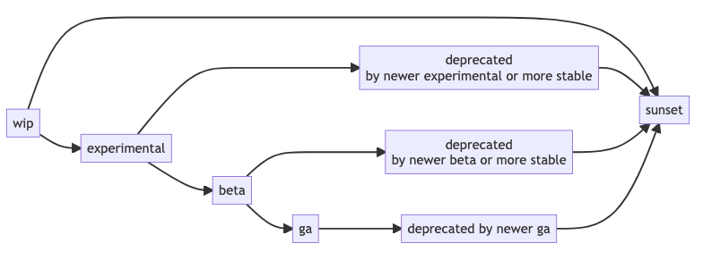
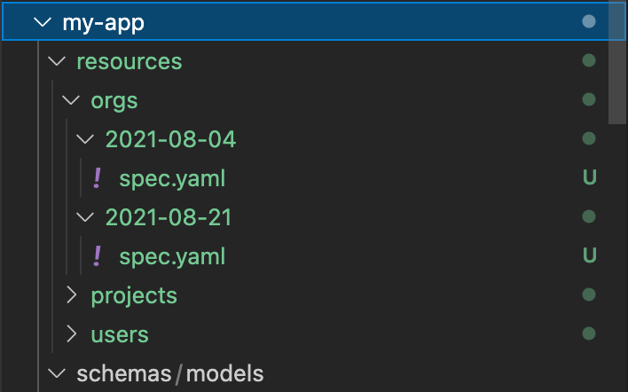
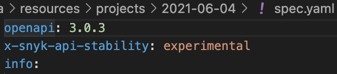

# Versioning

Fundamental to building an incredible API is the ability to evolve resources over time while giving our customers and partners time to adjust to any changes. This section focuses on how we enable product teams at Snyk to confidently develop endpoints that can evolve over time with versioning.

## Lifecycle of a resource version

At its core, versioning is about defining a lifecycle for versions of resources. This lifecycle impacts how we implement resources, how those resources are consumed, and forms the guarantees we provide our customers.



Resources start out as work-in-progress (wip) and evolve from one stage to another as they increase in stability over time.

Evolving resources, releasing them with the appropriate stability level and ensuring they meet the appropriate criteria is the responsibility of the owning team.

### Breaking changes

A new version of a resource is required if a **[breaking change](https://github.com/watson-developer-cloud/api-guidelines#what-counts-as-breaking)** is made. We strongly prefer only making additive changes if possible. However, if a breaking change must be made a new version of the endpoint **must** be introduced.

We never make a change to an existing version of an endpoint that could result in our customer’s or partner’s production code-breaking. Instead, we evolve our endpoints by introducing new versions and provide our customers ample time & warning to upgrade.

### Releases can only increase in stability (or sunset by newer releases)

A resource version can be "promoted" to greater stability. For example, you may decide that you're ready to commit an experimental version to beta-quality, or what was in beta, is now ready for general availability.

However, you "can't go back". If you find that it's "back to the drawing board" with a resource version, then a new version needs to be created at that later point in time — you can't lower the stability of an already-released version!

## Versioning resources

### Resource specification versions

The specification for how a resource behaves and what it contains is expressed with [OpenAPI 3](https://spec.openapis.org/oas/latest.html). This OpenAPI specification is the single source of truth for what goes into a resource version.

### Version format

A version consists of:

- A **date** (*YYYY-mm-dd*)
- A **stability level**, one of: `wip`, `experimental`, `beta`, or `ga`

The version date must be the day that the resource version was originally introduced.

Versions must not be released or requested at a future date.

Version dates must always be interpreted assuming a UTC timezone.

### Stability levels

Stability levels guarantee a certain level of consistency in the API contract, as well as its availability and potential expiration. They also define the **lifecycle stage** of a resource version up until deprecation.

In increasing order of stability, from least to most stable, these are:

- `wip`
    - The resource is just getting started and functionally may be in a broken or incomplete state with regard to its OpenAPI spec. WIP-versioned resources should not be made publicly accessible.
- `experimental`
    - The resource version is a functional implementation of its OpenAPI spec.
    - It will be available for at least **30 days** after a subsequent resource version *of equal or greater stability* is published, after which it may be removed.
    - During its availability, it may be revised with incompatible and breaking changes.
    - May be distributed as a limited tech preview.
- `beta`
    - The resource version may be regarded as a candidate for general availability.
    - It will be available for at least **90 days** after a subsequent resource version *of equal or greater stability* (`beta` or `ga`) is published, after which it may be removed.
    - During its availability, it must not be revised with incompatible and breaking changes.
    - It may be revised with backwards-compatible, additive changes.
- `ga`
    - The resource version is a generally available feature of the API.
    - It will be available for at least **180 days** after a subsequent `ga` resource version is published, after which it may be removed.
    - During its availability, it must not be revised with incompatible and breaking changes.
    - It may be revised with backwards-compatible, additive changes.

### Increasing stability of a release

A release version may be promoted to a greater stability, retroactively. For example:

- Resource version `2021-06-04~wip` is first introduced into a service on June 4, 2021.
- It is shortly promoted to `2021-06-04~experimental`. The stability level is updated in-place.
- Several weeks later, it is considered stable enough to promote to `2021-06-04~beta`.

### Deprecation and Sunset

When a new version of a resource is released, it deprecates any existing version of the resource at the same stability level. A version is considered **deprecated** until it is past the mandatory duration of availability for its stability level (as defined above), after which, it may be **sunset** — removed and no longer available.

## Resource versioning in projects

Our lifecycle version management tooling, [Vervet](https://github.com/snyk/vervet), assumes a directory structure of resources and their version release dates, each containing an OpenAPI `spec.yaml` defining the resource at that version.



These specs can and generally should be co-located with their code implementation. That implementation may even be generated in-part from the spec.

### Version stability levels

A version's stability level is expressed in each OpenAPI `spec.yaml` with a top-level extension, `x-snyk-api-stability`.



## API versions from individual resources

[**Vervet**, an API lifecycle management tool](https://github.com/snyk/vervet), merges all the individual resources and their versions in the directory structure described above, into a collection of OpenAPI specifications for the entire API at each version.


These versions may then be published, used to generate documentation, client SDKs, etc.

Versions for the entire API are expressed in the form *`{version date}~{stability level}`*, assuming GA was not specified.

## <a id="resolving-versions"></a>How are versions accessed and resolved by consumers?

Consumers of the API can request a version of the API at any point in time, at any stability level. These dates and versions do not need to exactly match the resolved versions — they are resolved by a search. For example a request like:

```json
GET /path/to/resource?version=2021-09-21~beta
```

will match the most recent OpenAPI specification containing resources of **beta** stability or greater, as of 2021-09-21. If stability is not specified, the default is GA, so:

```json
GET /path/to/resource?version=2021-09-21
```

would match only resource versions released as GA, as of 2021-09-21.

As a shortcut, you can also request "today's latest experimental" with:

```json
GET /path/to/resource?version=experimental
```

Developing against a "floating version" like this would not be recommended, but it can be a useful way to discover new development.

# Versioning in requests and responses

With the concept of versioning established, requests and responses must support certain parameters and headers related to versioning.

## `version` query parameter

All requests must provide a `?version=YYYY-mm-dd~stability` parameter:

- `~stability` may be omitted when the date is provided, to assume GA stability
- `YYYY-mm-dd~` may be omitted when the stability is provided, to assume "today"

Services are responsible for routing requests at the given `version` to the appropriate matching resource version implementation — or response with `HTTP 404` if no version of the resource exists.

If a request does not provide a version query parameter or the format of the parameter is misformed a 400 Bad Request *must* be returned. This is to prevent our customer's implementations from breaking as we release new versions of a resource.

## <a id="response-headers"></a>Versioning response headers

Responses must inform the requesting client how the version was resolved and the status of the matched version with these headers:

- `deprecation` - Indicates a newer version of the resource that deprecates the one that was matched. Conforms to [draft-dalal-deprecation-header-00](https://tools.ietf.org/id/draft-dalal-deprecation-header-00.html).
- `snyk-version-lifecycle-stage` - Indicates the actual lifecycle stage of the resource version that matched. A matched resource may be of equal or greater stability than requested. This stage also indicates `deprecated` and `sunset` lifecycle stages as described above.
- `snyk-version-requested` - Confirm the version that was requested.
- `snyk-version-served` - The version that matched the request. Note that the matched version may be of equal or greater stability, and at the most recent version date prior to the date requested.
- `sunset` - [RFC 8594](https://datatracker.ietf.org/doc/html/rfc8594) standard header reflecting the sunset date of a deprecated resource.

## Consuming the versioned API

Using the `?version=` parameter, clients may choose to interact with any released version of the API.

To release a stable application, choose an announced GA release date, and be assured that the API will not change for at least 180 days past the following GA release.

To evaluate a recent beta feature, you might pin your version date at "yesterday" and use that with `~beta`. Keep that version date pinned at the date you started with, until you're ready to evaluate or support a newer release of the API.

To browse the latest experimental changes, you might request the OpenAPI specification for `?version=experimental`. However, floating versions should never be used in client code.

Clients must be developed against (or generated from) a pinned version of the API declaring a fixed _YYYY-mm-dd_ release date. Otherwise the client may fail in unexpected ways, possibly with undefined behavior when new versions of the API are released.

The response headers can be used to receive advance notice that an API change is coming. The [standard `sunset` header](https://datatracker.ietf.org/doc/html/rfc8594), for example, can be used to alert that the API needs to be updated soon.
